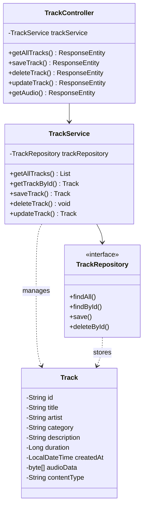

# Project Architecture

## Class Diagram (Backend)

```mermaid
classDiagram
    class TrackController {
        -TrackService trackService
        +getAllTracks() ResponseEntity
        +saveTrack() ResponseEntity
        +deleteTrack() ResponseEntity
        +updateTrack() ResponseEntity
        +getAudio() ResponseEntity
    }
    
    class TrackService {
        -TrackRepository trackRepository
        +getAllTracks() List
        +getTrackById() Track
        +saveTrack() Track
        +deleteTrack() void
        +updateTrack() Track
    }
    
    class TrackRepository {
        <<interface>>
        +findAll()
        +findById()
        +save()
        +deleteById()
    }
    
    class Track {
        -String id
        -String title
        -String artist
        -String category
        -String description
        -Long duration
        -LocalDateTime createdAt
        -byte[] audioData
        -String contentType
    }

    TrackController --> TrackService
    TrackService --> TrackRepository
    TrackService ..> Track : manages
    TrackRepository ..> Track : stores
```
